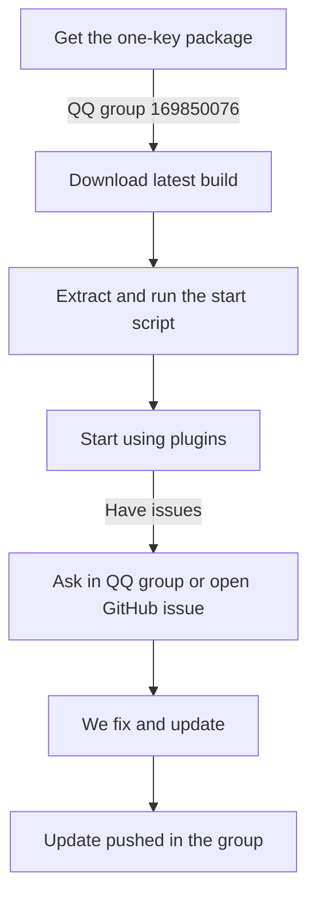

# One-Key Package User Guide

## Last Updated
2025-11-20

---

## What We Provide: One-Key Package

### Change Summary
We ship a one-key installer for MoFox-Core so you can deploy quickly without manual environment setup.

### Problems With The Old Flow
- Manual Python installation
- Manual dependency installation
- Manual configuration edits
- Complex process and easy to break

### New Design
- Bundled Python 3.11 runtime
- Preinstalled dependencies (requirements.txt)
- Default configs pre-bundled
- One-click start script (Windows)

### Benefits
- Zero-config, ready to run
- Windows supported
- Lightweight: only essentials included
- Online update support to the latest version

---

## Join The QQ Group To Get It

### How To Get The Package
| Method | Details |
| ------ | ------- |
| QQ group ID | 169850076 (official group) |
| Group name | MoFox Origin |
| Verification message | Follow the group prompt |

### What You Get In The Group
- Latest one-key package in group files
- Install help from admins
- Step-by-step tutorials in announcements
- Update notifications first-hand

### Join Steps
```
1. Open QQ and search the group ID: 169850076
2. Send the verification message as instructed
3. Wait for approval
4. After joining: check group files -> download the latest package -> read the tutorial
```

### Why Join
- Official download channel for safety and freshness
- Real-time support when you hit issues
- User discussions and tips

---

## Thanks And Feedback

We appreciate your use of MoFox-Core. If you run into problems or have ideas, please open a GitHub Issue.

### Contribution Recognition
- Valid bug reports: credited in the next release notes
- Strong feature suggestions: prioritized and credited
- Consistent contributors: may be invited as maintainers

---

## Overall Impact

### User Experience
- Lower barrier: no technical background required
- Time saving: deploy in about 5 minutes
- Ongoing support: QQ group plus GitHub

### Community
- User gathering: QQ group for experience sharing
- Feedback loop: Issues are trackable on GitHub

---

## Usage Flow Summary



---

## Roadmap

- Add a graphical config UI
- Add automatic environment detection
- Add update reminders

---

## Contributors

- MoFox Team - One-key package build and maintenance
- Community users - Feedback and suggestions

---
## Changelog

- 2025-11-20: First release of the one-key package guide
  - Windows support provided
  - QQ group plus GitHub feedback loop established

