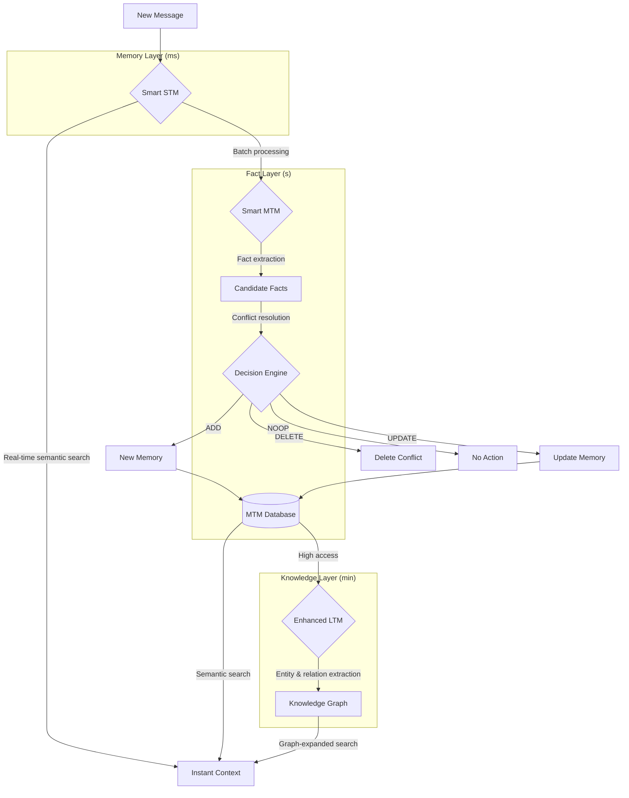
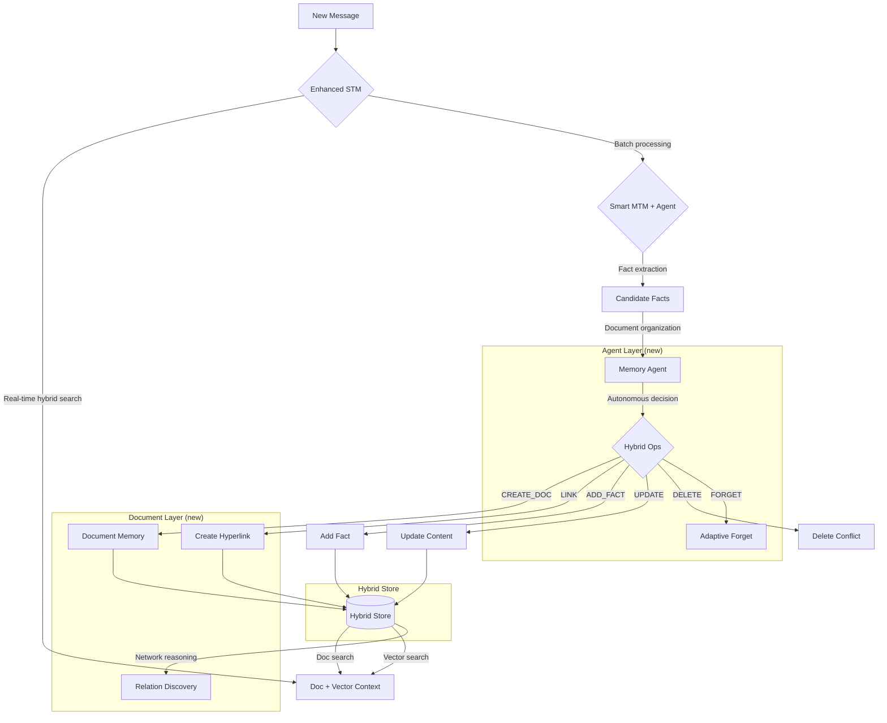

# MoFox_Bot Memory System Architecture v3.0
*Production-grade memory system inspired by Mem0*

## 🎯 1. Core Concepts

This architecture draws on **Mem0** design ideas to build an **intelligent, efficient, and scalable** memory system. It is fact-first, using a **two-stage intelligent pipeline** to turn fragmented messages into structured knowledge that supports **semantic search** and **relational reasoning**.

### Design Principles
- **Intelligence over rules**: Use LLMs for fact extraction and conflict resolution instead of simple thresholds.
- **Efficiency over completeness**: Focus on core facts, avoid redundancy and repetitive processing.
- **Semantics over literals**: Semantic search via vector similarity instead of keyword matching.
- **Async over sync**: Memory processing should not block the primary conversation flow.

## 📚 2. Three-Layer Architecture

### 2.1 Smart Short-Term Memory (STM)

**Role**: High-speed semantic cache + intelligent fact extractor

#### Key Functions
- **Message buffer**: In-memory queue for the most recent messages (recommended 200).
- **Real-time vectorization**: Asynchronously embed messages on enqueue.
- **Semantic retrieval**: Quickly fetch related context via similarity search.
- **Fact extraction**: Intelligently detect and extract important facts in dialog.

#### Technical Architecture
- **Memory queue**: Fixed-length deque for recent messages.
- **Vector cache**: Store embeddings of each message in memory.
- **Index**: FAISS or Annoy for fast vector search.
- **Flow**: Enqueue → async embedding → index update → batch transfer check.

#### Triggers
- **Scheduled batches**: Process a batch every fixed interval (e.g., 5 minutes).
- **Queue full**: Trigger batch transfer when capacity is reached.
- **Conversation idle**: Process during pauses in dialog.

### 2.2 Smart Mid-Term Memory (MTM)

**Role**: Fact manager + conflict resolver (Mem0 two-stage pattern)

#### Two-Stage Pipeline

##### Stage 1: Fact Extraction
**Input**: Message batch + conversation summary + latest 10 messages  
**Output**: Structured candidate fact list

**Extract**:
1. User preferences and habits
2. Important personal info  
3. Key decisions and plans
4. Emotional state changes

**Method**: LLM analyzes dialog and outputs JSON facts with content, importance score, fact type, and other metadata.

##### Stage 2: Conflict Resolution
**Process**:
1. Retrieve similar memories (top-k semantic search)
2. LLM analyzes relationships between new facts and existing memories
3. Decide operation type

**Operations**:
- **ADD**: Insert new memory
- **UPDATE**: Update existing memory
- **DELETE**: Remove contradictory or outdated memory
- **NOOP**: No action needed

**Decision**: Based on semantic similarity and timestamps, LLM chooses the best operation to keep the store consistent and accurate.

#### Memory Metadata
Each fact contains:
- **Basics**: Unique ID, content text, keyword list
- **Semantics**: Embedding, importance score, fact type
- **Time**: Created at, last accessed, access count
- **Ownership**: Conversation ID, user ID
- **Fact type**: Preference, personal info, plan, emotional state, etc.

### 2.3 Enhanced Long-Term Memory (LTM)

**Role**: Knowledge graph + reasoning engine (integrates existing Hippocampus)

#### Promotion Rules
- **Access frequency**: `access_count >= 10`
- **Importance**: `importance_score >= 0.8`
- **Persistence**: Older than 7 days and still accessed

#### Graph Enhancement (Mem0g-inspired)
**Components**:
- **Entity extractor**: Identify people, places, concepts from facts
- **Relationship builder**: Create triples from semantic relations
- **Graph integrator**: Merge new triples into the knowledge graph

**Flow**:
1. Extract entities from promoted facts
2. Build relation triples
3. Integrate with Hippocampus graph
4. Support multi-hop reasoning and relation queries

## 🔄 3. Processing Flow



## ⚙️ 4. Configuration

### 4.1 Core Settings
```toml
[memory_v3]
enable = true
processing_mode = "async"  # async/sync

[memory_v3.stm]
max_size = 200
batch_size = 50
vector_index_type = "faiss"  # faiss/annoy
similarity_threshold = 0.75
embedding_model = "text-embedding-3-small"

[memory_v3.mtm]
fact_extraction_batch_size = 20
importance_threshold = 0.6
conflict_resolution_top_k = 10
max_facts_per_batch = 50

[memory_v3.ltm]
promotion_access_threshold = 10
promotion_importance_threshold = 0.8
promotion_time_threshold = 604800  # 7 days (seconds)
enable_graph_enhancement = true
```

### 4.2 Performance Settings
```toml
[memory_v3.performance]
max_concurrent_extractions = 3
llm_timeout = 30
vector_cache_size = 10000
enable_compression = true
compression_ratio = 0.1

[memory_v3.personalization]
enable_user_profiling = true
enable_context_adaptation = true
enable_emotional_weighting = true
```

## 🚀 5. Performance Optimizations

### 5.1 Async Pipeline
**Idea**: Separate main dialog flow from memory processing to keep responses fast.

**Modes**:
- **Foreground**: Retrieve context from STM immediately for quick replies.
- **Background**: Async fact extraction, conflict resolution, and memory updates.
- **Pipeline**: Process multiple messages in parallel to raise throughput.

### 5.2 Batch Optimizations
- **Batch embeddings**: Fewer model calls.
- **Batch DB ops**: Better I/O efficiency.
- **Batch LLM inference**: Lower API cost.

### 5.3 Caching
- **Vector cache**: Keep common embeddings in memory.
- **Query cache**: Reuse similar query results.
- **LRU eviction**: Auto-clean stale cache entries.

## 🛡️ 6. Error Handling & Degradation

### 6.1 Layered Fallbacks
**LLM fallback**:
- Fact extraction fails → keyword-based rules.
- Conflict resolution fails → timestamp-based dedup.
- Importance scoring fails → heuristic by message length.

**Vector service fallback**:
- Vector search fails → keyword match.
- Embedding fails → TF-IDF or other classic methods.
- Index issue → temporary linear search.

### 6.2 Resilience
- **Timeout guard**: LLM timeouts trigger fallback.
- **Retries**: Exponential backoff on network errors.
- **Backups**: Multiple replicas for key memories.
- **State recovery**: Resume processing after restart.

## 🎨 7. Personalization & Adaptation

### 7.1 User Profiling
**Dimensions**:
- **Interests**: Topics the user cares about.
- **Communication style**: Formal/informal, concise/detailed.
- **Memory preference**: Types and focus of information to retain.

**Mechanisms**:
- Adjust importance scores based on interests.
- Tailor memory phrasing to communication style.
- Decide retention policy by user preference.

### 7.2 Context Awareness
- **Time-aware**: Work hours vs leisure priority.
- **Scene-aware**: Group chat vs private chat strategies.
- **Emotion-aware**: Emotional state influences weighting.

### 7.3 Dynamic Tuning
**Strategies**:
- **Performance-driven**: Auto-tune thresholds by accuracy and latency.
- **Usage-driven**: Optimize configs by behavior patterns.
- **Resource-driven**: Adjust parameters based on system load.

**Adjustable**:
- Importance threshold for extraction.
- Batch size and frequency.
- Similarity threshold for search.
- Access threshold for promotion.

## 📊 8. Monitoring & Analytics

### 8.1 Key Metrics
- **Memory quality**: Fact accuracy, relevance scores.
- **System performance**: Retrieval latency, throughput.
- **User experience**: Memory hit rate, reply coherence.
- **Resource use**: Token cost, memory footprint.

### 8.2 Dashboards
**Dimensions**:
- **STM**: Queue usage, hit rate, embedding efficiency.
- **MTM**: Extraction success, conflict resolution accuracy, storage growth.
- **LTM**: Promotion rate, graph size, reasoning performance.
- **User behavior**: Access patterns, preference shifts.
- **System**: Latency, resource consumption, error rate.

## 🛣️ 9. Roadmap

### Phase 1: Core Refactor (2 weeks)
- [ ] Rebuild STM as a true in-memory queue
- [ ] Implement basic vector search
- [ ] Add async processing framework

### Phase 2: Intelligent Upgrade (3 weeks)
- [ ] Implement two-stage MTM processing
- [ ] Integrate fact extraction and conflict resolution
- [ ] Complete configuration system

### Phase 3: Performance Tuning (2 weeks)
- [ ] Optimize batch processing
- [ ] Implement caching strategies
- [ ] Strengthen error handling

### Phase 4: Personalization (2 weeks)
- [ ] Integrate user profiles
- [ ] Dynamic parameter tuning
- [ ] Monitoring and analytics system

## 🎯 10. Expected Outcomes

Based on Mem0 benchmarks, we expect:
- **Accuracy gain**: 20–30% improvement vs current system.
- **Lower latency**: Retrieval under 200 ms.
- **Cost savings**: Token use down by 80%+.
- **User experience**: Noticeably better coherence.

---

*This design blends Mem0 concepts with MoFox requirements to build a production-grade intelligent memory system.* 

## 🔍 11. MemU Architecture Analysis & Integration

### 11.1 MemU vs Mem0: Philosophy

During research we found another strong framework, **MemU**, which inspired new ideas.

#### Key Differences

| Dimension | Current (Mem0-based) | MemU | Advantage |
|------|------------------|---------|----------|
| **Storage** | Vector DB + structured facts | Document memories + file system | MemU: contextual completeness; Mem0: precise retrieval |
| **Process** | Two-stage: extraction → conflict resolution | Agent-driven: autonomous decisions | MemU: adaptability; Mem0: controllability |
| **Organization** | Hierarchy (STM→MTM→LTM) | Networked hyperlinks | MemU: relational reasoning; Mem0: clear hierarchy |
| **Performance** | 26% uplift vs OpenAI | 92.09% Locomo accuracy | MemU: higher accuracy; Mem0: lower latency |

#### MemU Innovations

**Memory as File System:**
- **🗂️ Autonomous organization**: Memory Agent records, edits, archives.
- **🔗 Smart links**: Auto-create semantic links between memories.
- **🌱 Continuous evolution**: Keeps analyzing offline to generate insights.
- **🧠 Adaptive forgetting**: Adjust priority by usage patterns.

### 11.2 Hybrid Architecture

#### Dual Storage

**Two systems in parallel:**

**Document store (MemU-inspired):**
- Group related memories into full "documents," like journals.
- Each document has a topic (e.g., dietary preferences, work schedule).
- Documents reference each other to form a knowledge network.

**Vector store (Mem0-retained):**
- Convert each fact into an embedding for storage.
- Best for precise lookup.
- Complements the document system.

**Mode:**
- Prefer document store for answers (fast, contextual).
- If missing, fall back to vector search (precise).
- Merge results for completeness.

#### Enhanced Flow



### 11.3 Memory Agent Plan

#### How the Agent Works

**Memory Agent behaves like a sharp librarian:**

**Daily workflow:**
1. **Collect** new facts from dialog.
2. **Choose storage**: create a new document or append to an existing one.
3. **Link**: find relationships with existing memories.
4. **Act**: decide the right operation.

**Background maintenance:**
- **Analyze usage**: see which memories are frequently accessed.
- **Generate insights**: find patterns and connections.
- **Prioritize**: surface important memories.
- **Smart forgetting**: let low-value memories fade.

#### Expanded Operations

**Extend the original four operations with five intelligent actions:**

**Existing (kept):**
- **Add**: Insert a brand-new fact.
- **Update**: Modify existing content.
- **Delete**: Remove conflicting or wrong facts.
- **No-op**: Do nothing when info is duplicate or low value.

**New (MemU-inspired):**
- **Document**: Organize related facts into a themed doc.
- **Link**: Create references between related memories.
- **Reorganize**: Adjust categories and structure.
- **Adaptive forget**: Fade based on importance and frequency.
- **Synthesize**: Generate new insights from multiple memories.

### 11.4 Performance Tactics

#### Smarter Batching

**Why batch?**
- Like laundry: a full load is more efficient than single items.
- Fewer LLM calls → lower cost.
- Processing long dialog chunks (e.g., 8k tokens) at once works better than many small ones.

**When to batch?**
- After accumulating enough messages (e.g., 50).
- When the topic shifts.
- During user idle time for background cleanup.

#### Hybrid Retrieval Strategy

**Four steps for speed and accuracy:**

1. **Document-first**: Search organized docs first.  
   - Fast, contextual.  
   - Handles most common queries.

2. **Vector precision**: If docs miss, fall back to embeddings.  
   - High precision for specific facts.

3. **Link expansion**: Use memory links to find related info.  
   - Good for reasoning-heavy queries.

4. **Smart merge**: Combine and rank results by relevance, recency, and importance; dedupe answers.

### 11.5 Updated Roadmap

#### Step 1: MemU Fusion Trial (2 weeks)
**Goal: validate hybrid feasibility**
- [ ] Build document store so memories can be saved as docs
- [ ] Develop basic Memory Agent to choose operations automatically
- [ ] Establish dual retrieval (docs + vectors)
- [ ] Compare accuracy and speed vs current scheme

#### Step 2: Smarter Capabilities (2 weeks)
**Goal: make the system truly smart**
- [ ] Auto-organize and classify memories
- [ ] Build intelligent link network
- [ ] Implement adaptive forgetting
- [ ] Optimize batching to cut cost

#### Step 3: Validate & Tune (1 week)
**Goal: confirm the hybrid meets targets**
- [ ] Use benchmarks to verify accuracy
- [ ] Push toward MemU's 92% accuracy
- [ ] Verify cost reduction
- [ ] Tune weights per results

### 11.6 Expected Gains

With MemU-style fusion, we expect further boosts:

- **Accuracy**: From current 20–30% gains to 40–50% (aiming at MemU's 92%).
- **Context completeness**: Stronger via documents.
- **Relational reasoning**: Better through hyperlink networks.  
- **Adaptivity**: Memory Agent enables smarter management.
- **Cost efficiency**: Batching and doc-first retrieval cut cost.

### 11.7 Risks & Challenges

#### Concerns

**Increased complexity:**
- Two storage systems (docs + vectors) to maintain.
- Added agent requires coordination.
- More features → more failure modes.

**Data consistency:**
- Doc and vector stores may drift.
- Agent actions could have unintended effects.
- Different update times across stores.
