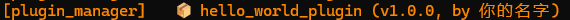

# 🚀 Quick Start Guide

This guide will take you from scratch to creating a fully functional MoFox_Bot plugin.

## 📖 Overview

This guide will take you quickly through creating your first MoFox_Bot plugin. We will create a simple greeting plugin that demonstrates the basic concepts of the plugin system.

All code below is in our `plugins/hello_world_plugin/` directory.

### A Convenient Design

In development, we defined an `__all__` variable in `__init__.py` that includes all classes and functions that need to be exported.
This way, when importing elsewhere, you can directly use `from src.plugin_system import *` to import all plugin-related classes and functions.
Or you can directly use `from src.plugin_system import BasePlugin, register_plugin, ComponentInfo` and similar ways to import only the parts you need.

### 📂 Preparation

Make sure you have:

1. Cloned the MoFox_Bot project
2. Installed Python dependencies
3. Understand basic Python syntax

## 🏗️ Creating a Plugin

### 1. Create Plugin Directory

Create your plugin directory in the `plugins/` folder in the project root

Here we create a directory named `hello_world_plugin`

### 2. Create `_manifest.json` File

Create a `_manifest.json` file in the plugin directory with the following content:

```json
{
  "manifest_version": 1,
  "name": "Hello World Plugin",
  "version": "1.0.0",
  "description": "A simple Hello World plugin",
  "author": {
    "name": "Your Name"
  }
}
```

For detailed explanation of `_manifest.json`, refer to [Manifest File Guide](./manifest-guide.md).

### 3. Create the Simplest Plugin

Let's start with the basics! Create `plugin.py` file:

```python
from typing import List, Tuple, Type
from src.plugin_system import BasePlugin, register_plugin, ComponentInfo

@register_plugin # Register the plugin
class HelloWorldPlugin(BasePlugin):
    """Hello World Plugin - Your first MoFox_Bot plugin"""

    # The following are basic plugin information and methods (must fill in)
    plugin_name = "hello_world_plugin"
    enable_plugin = True  # Enable the plugin
    dependencies = []  # Plugin dependency list (currently empty)
    python_dependencies = []  # Python dependency list (currently empty)
    config_file_name = "config.toml"  # Configuration file name
    config_schema = {}  # Configuration file schema (currently empty)

    def get_plugin_components(self) -> List[Tuple[ComponentInfo, Type]]: # Get plugin components
        """Return the list of components included in the plugin (currently empty)"""
        return []
```

🎉 Congratulations! You've just created the simplest yet complete MoFox_Bot plugin!

**Explanation of the code:**

- First, we defined a HelloWorldPlugin plugin class in `plugin.py` that inherits from `BasePlugin` and provides basic functionality.
- By adding the `@register_plugin` decorator to the class, we tell the system "this is a plugin"
- `plugin_name` and others are basic plugin information that must be filled in
- `get_plugin_components()` returns the plugin's functional components, now we haven't defined any Action, Command or EventHandler, so it returns an empty list.

### 4. Test Basic Plugin

Now you can test this plugin! Start MoFox_Bot:

Run MoFox_Bot directly through the launcher or `python bot.py`

You should see plugin loading information in the logs. Although the plugin doesn't have any functionality yet, it's already running successfully!



### 5. Add First Feature: Greeting Action

Now we'll add a useful feature to the plugin. Let's start with the most fun part - Action.

Action is a type of component that allows MoFox_Bot to choose to use "actions" based on its own will. In MoFox_Bot, whether "replying" or "not replying", or "sending emojis" and "silencing" and so on, are all implemented through Action.

You can extend MoFox_Bot's capabilities by writing actions, including sending voice, screenshots, and even operating files, writing code......

Now let's add a simple first feature to the plugin. This Action can send a greeting message to users.

Add Action component to the `plugin.py` file, complete code is as follows:

```python
from typing import List, Tuple, Type
from src.plugin_system import (
    BasePlugin, register_plugin, BaseAction, 
    ComponentInfo, ActionActivationType, ChatMode
)

# ===== Action Component =====

class HelloAction(BaseAction):
    """Greeting Action - Simple greeting action"""

    # === Basic Information (must fill) ===
    action_name = "hello_greeting"
    action_description = "Send greeting message to users"
    activation_type = ActionActivationType.ALWAYS  # Always activate

    # === Functional Description (must fill) ===
    action_parameters = {"greeting_message": "Greeting message to send"}
    action_require = ["Use when sending friendly greetings", "Use when someone says hello to you", "Use when you meet someone new"]
    associated_types = ["text"]

    async def execute(self) -> Tuple[bool, str]:
        """Execute greeting action - This is the core functionality"""
        # Send greeting message
        greeting_message = self.action_data.get("greeting_message", "")
        base_message = self.get_config("greeting.message", "Hi! Nice to meet you! 😊")
        message = base_message + greeting_message
        await self.send_text(message)

        return True, "Sent greeting message"

@register_plugin
class HelloWorldPlugin(BasePlugin):
    """Hello World Plugin - Your first MoFox_Bot plugin"""

    # Plugin basic information
    plugin_name = "hello_world_plugin"
    enable_plugin = True
    dependencies = []
    python_dependencies = []
    config_file_name = "config.toml"
    config_schema = {}

    def get_plugin_components(self) -> List[Tuple[ComponentInfo, Type]]:
        """Return the list of components included in the plugin"""
        return [
            # Add our greeting Action
            (HelloAction.get_action_info(), HelloAction),
        ]
```

**Explanation of the code:**

- `HelloAction` is the greeting action class we defined, inheriting from `BaseAction`, and implements core functionality.
- In `HelloWorldPlugin`, we register `HelloAction` as a component of the plugin through the `get_plugin_components()` method by calling the built-in `get_action_info()` method.
- This way, when the plugin is loaded, the greeting action will also be loaded and can be used in MoFox_Bot.
- The `execute()` function is the core of Action, defining what specifically MoFox_Bot should do when the Action is chosen.
- `self.send_text()` is a convenient method for sending text messages

For detailed explanation of `activation_type`, `action_parameters`, `action_require`, `associated_types` and other features in the Action component, refer to [Action Component Guide](./action-components.md).

### 6. Test Greeting Action

Restart MoFox_Bot, then send any message in the chat, such as:

```
Hello
```

MoFox_Bot may choose to use your greeting Action and send a reply:

```
Hi! Nice to meet you! 😊
```


> **💡 Tip**: MoFox_Bot will intelligently decide when to use it. If you don't see the effect immediately, try a few different messages.

🎉 Awesome! Your plugin now has actual functionality!

### 7. Add Second Feature: Time Query Command

Now let's add a Command component. Command is different from Action, it directly responds to user commands:

Command is the simplest, most direct response, not judged by LLM for selection.

```python
# Add Command component based on existing code
import datetime
from src.plugin_system import PlusCommand, CommandArgs
# Import enhanced command base class - recommended to use!

class TimeCommand(PlusCommand):
    """Time Query Command"""

    # === Basic Information (must fill) ===
    command_name = "time"
    command_description = "Get current time"
    command_aliases = ["t", "now"]  # Optional: command aliases

    async def execute(self, args: CommandArgs) -> Tuple[bool, Optional[str], bool]:
        """Execute time command - Direct response"""
        current_time = datetime.datetime.now().strftime("%Y-%m-%d %H:%M:%S")
        await self.send_text(f"⏰ Current time: {current_time}")
        
        return True, "Sent current time", True
```

Add this to the plugin's `get_plugin_components()`:

```python
def get_plugin_components(self) -> List[Tuple[ComponentInfo, Type]]:
    """Return the list of components included in the plugin"""
    from src.plugin_system import create_plus_command_adapter
    
    components = [
        (HelloAction.get_action_info(), HelloAction),
        # Add time command
        (TimeCommand.get_command_info(), create_plus_command_adapter(TimeCommand)),
    ]
    return components
```

### 8. Test Time Command

After restarting MoFox_Bot, try sending the command:

```
/time
```

or use the alias:

```
/t
```

MoFox_Bot will respond with the current time:

```
⏰ Current time: 2024-01-15 14:30:45
```

🎉 Now your plugin has both Actions and Commands!

## 📚 Next Steps

- **Learn More Commands**: Read the [Enhanced Command Guide](PLUS_COMMAND_GUIDE.md)
- **Master Actions**: Read the [Action Component Guide](action-components.md)
- **Add Configuration**: Read the [Configuration File System Guide](configuration-guide.md)
- **Troubleshoot Issues**: Check the [Troubleshooting Guide](troubleshooting-guide.md)

## 🎊 Congratulations!

You've successfully created your first MoFox_Bot plugin! From here, you can:

1. Add more Actions and Commands
2. Integrate external services
3. Add configuration options
4. Publish your plugin to the community

Happy coding! 🚀
